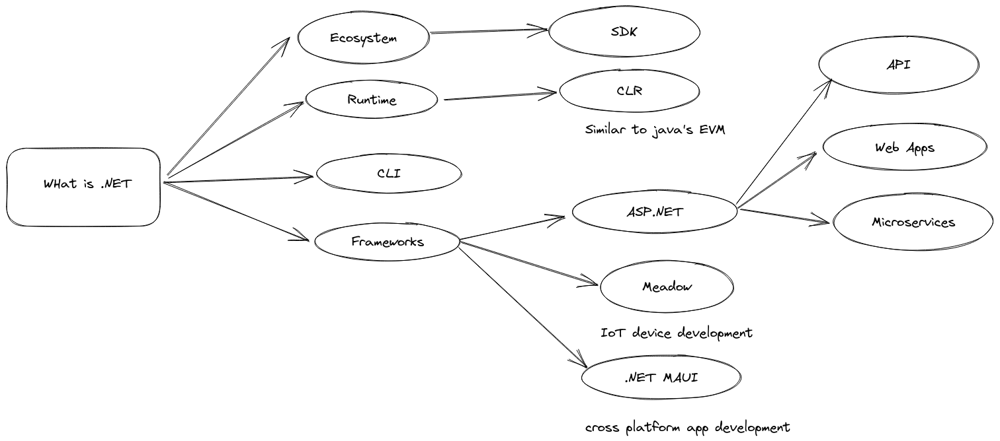

# Overview
.Net is a ecosystem of development. unlike other traditional frameworks it contains
multiple frameworks within itself. .net is a platform for building almost anything. 
from a simple console based app to iot devices everything can de developed using blockchain



#### Ecosystem
Before .NET 6 there were multiple different flavours of dotnet. For example
.NET framework was used to develop windows desktop apps, .NET Core is a newer
open-source implementation and is cross-platform and finally Xamarin is the
framework used to develop mobile apps. But with the migration from .NET 5 to 6
all these frameworks were combined into one single SDK(Software development
Kit), and BCL(Base Class Library) Thus we have a basic idea that .NET is a big
ecosystem which has capability to build anything and everywhere. Now this
consists of:

 * Languages — C#, F#, VB
 * Runtime — Common language runtime
 * CLI — Dotnet CLI
 * Libraries — Base class libraries and 3rd party available through Nuget
 
### Runtime
.NET is not just a C# based framework but a common language runtime where multiple
different programming language can compile down to. C#, F# and Visual Basics are
some of the popular languages that compile down to the CLR. The CLR is like 
JVM in java. It follows the same philosophy of "write once run anywhere". 

The
common language runtime makes it easy to design components and applications
whose objects interact across languages. Objects written in different
languages can communicate with each other, and their behaviors can be tightly
integrated. For example, you can define a class and then use a different
language to derive a class from your original class or call a method on the
original class. You can also pass an instance of a class to a method of a
class written in a different language. This cross-language integration is
possible because language compilers and tools that target the runtime use a
common type system defined by the runtime. They follow the runtime's rules for
defining new types and for creating, using, persisting, and binding to types. 

### CLI

dotnet cli is a part of the .NET SDK. It is a cross-platform toolchain for developing,
building, running and publishing .NET applications. In this project we use this cli
to create the webapp, add dependencies, run the application and others. 

###  Frameworks
In this project we are going to use ASP.NET for developing the server side application.
We use it to create API and create websocket endpoints for the users, so that
they can communicate with each other in realtime. 


# Building the application

### Installing the SDK
At 1st we should install the SDK and update the path. This process is platform
dependent, the process to install the SDK is well documented
[here](https://dotnet.microsoft.com/en-us/download)

### Creating a and running the project

```bash
dotnet new webapi -f net6.0
dotnet run
```


