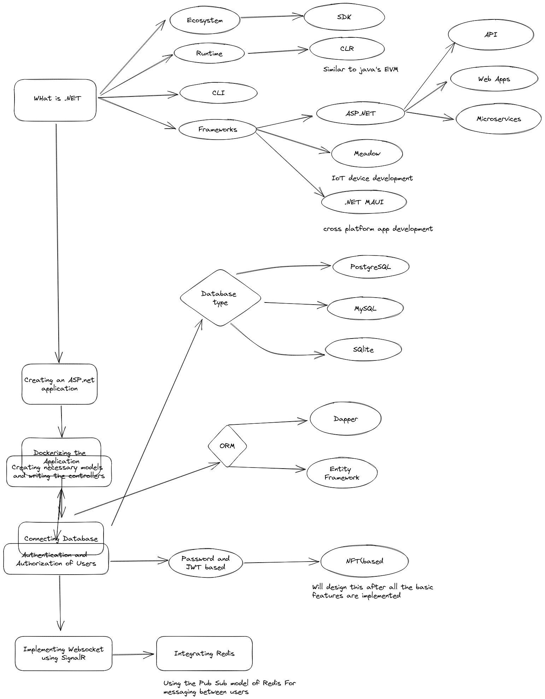
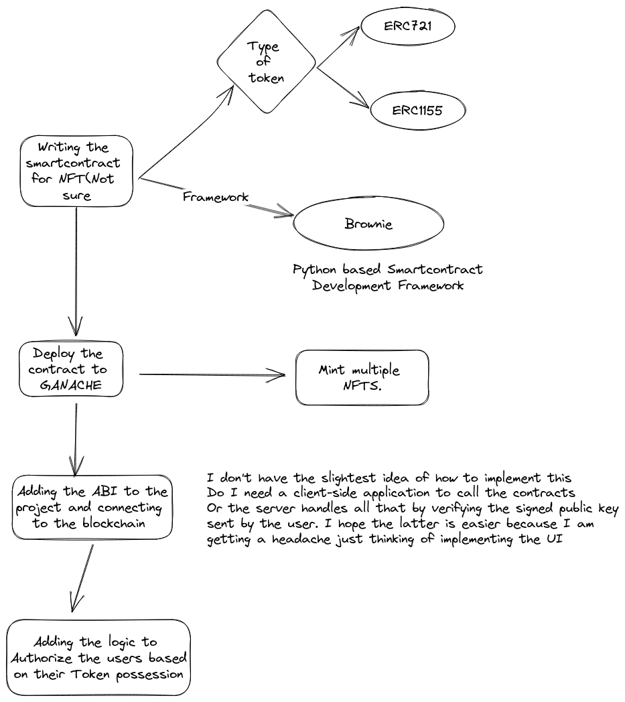

# Chat-room-for-nft-owners
I want to implement most of the tech stacks I know in this project.
The main objective of this project for me is to get
familier with .NET and blockchain development (very different stacks), 
learning Docker,  and getting familier with proper
versioning conventions. The deliverable of this project is a deployment ready docker
container which can run the entire application with just `docker run`.

## Roadmap
### The basic app without the NFT implementation

### SmartContract deployment and integration

#### For the additional documentation. Checkout to Documentation branch. ` i know its not proper convention `
